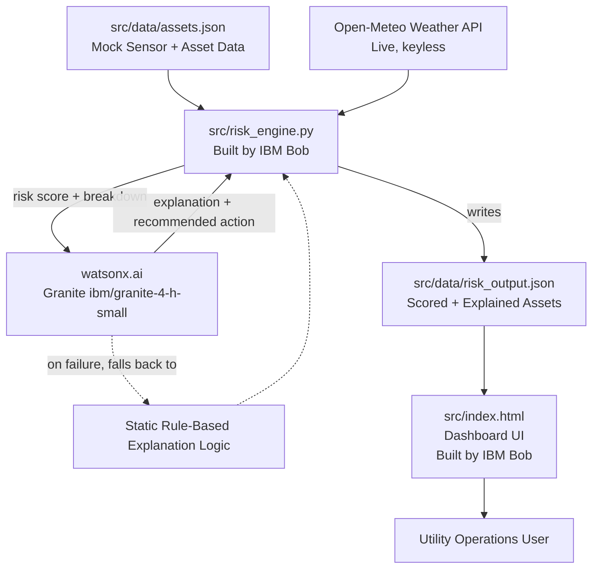

# System Architecture

## Architecture Diagram

## Component Table

| Component | Technology | Responsibility |
|---|---|---|
| Asset & Sensor Data | Static JSON (`assets.json`) | Stores synthetic sensor readings (temperature, vibration, oil quality, partial discharge) and metadata (criticality, customers served, age, prior failures) for each monitored grid asset |
| Weather Integration | Open-Meteo REST API (Python `requests`) | Provides live temperature, wind speed, and precipitation for the monitored region, no API key required |
| Risk Engine | Python (`risk_engine.py`), built by IBM Bob | Loads asset data, fetches live weather, computes a weighted risk score per asset, calls watsonx.ai to generate the explanation and recommended action, writes results to `risk_output.json` |
| Explanation Generation | watsonx.ai (`ibm/granite-4-h-small`) via `ibm-watsonx-ai` Python SDK (chat API) | Given an asset's risk score and its sensor/weather/criticality breakdown, generates a plain-language explanation and a recommended action; falls back to static rule-based text on any API failure |
| Risk Output | Static JSON (`risk_output.json`) | Structured, scored, and explained output — the single source of truth the dashboard reads from |
| Dashboard UI | Self-contained HTML/CSS/JavaScript (`index.html`), built by IBM Bob | Renders the risk data as a sorted, color-coded, interactive dashboard for utility operations staff |
| IBM Bob | AI coding agent (Agent mode, IDE extension) | Wrote and iteratively debugged `risk_engine.py`, `index.html`, and the watsonx.ai integration, including diagnosing and fixing a scoring-normalization bug and adapting to a deprecated Granite model ID |

## End-to-End Data Flow

1. **Data Ingestion** — `risk_engine.py` loads the static asset/sensor dataset and calls the Open-Meteo API for the monitored region's current weather.
2. **Risk Scoring** — for each asset, sensor readings are scored against safe-operating thresholds (60% weight), weather conditions are scored against safety ceilings (20% weight), and the asset's operational criticality contributes the remaining 20%. These are combined so that the single worst-breaching sensor sets a high floor for the score, and any additional breaches stack on top of it — rather than being averaged away by healthier readings.
3. **Explanation Generation** — for each asset, the risk score and its sensor/weather/criticality breakdown are passed to watsonx.ai's Granite model (`ibm/granite-4-h-small`), which returns a plain-language paragraph citing the specific values that produced the score, along with a concrete, time-bound recommended action. If the watsonx.ai call fails for any reason (network, auth, rate limit), the system automatically falls back to static rule-based explanation logic so the pipeline never breaks.
4. **Output** — all of this is written to `risk_output.json` as a single structured array, sorted by nothing in particular at this stage (sorting happens at render time).
5. **Rendering** — `index.html` loads `risk_output.json` (or an embedded fallback copy of the same data, for when the page is opened directly as a local file rather than through a server), sorts assets by risk score descending, and renders them as color-coded, expandable cards alongside summary statistics and a risk-distribution chart.

## Security & Scalability Notes

- **Credentials.** The only credentials used anywhere in this project are the `WATSONX_API_KEY` and `WATSONX_PROJECT_ID` needed to call watsonx.ai, loaded from a local `.env` file via `python-dotenv`. This file is excluded from version control by `.gitignore`, and a `.env.example` template (with no real values) is committed instead. The Open-Meteo weather API remains public and keyless. A `.bobignore` file is also configured at the repository root to prevent any secrets (`.env`, `secrets/`, `*.key`, `config/credentials.json`) from being indexed by IBM Bob.
- **No PII.** All asset and sensor data is synthetic, generated for demonstration purposes, and explicitly documented as such.
- **Graceful degradation.** The dashboard and risk scoring both function correctly even without watsonx.ai access — if the API call fails or credentials are missing, `risk_engine.py` falls back to static, rule-based explanation text rather than crashing or producing incomplete output.
- **Scalability path:** the current architecture reads a static JSON file for simplicity and reliability within the hackathon's scope. In a production setting, `assets.json` would be replaced by a live connection to a utility's existing SCADA/sensor telemetry system, and `risk_output.json` would be replaced by a proper database or message queue — the scoring logic and the watsonx.ai integration in `risk_engine.py` would not need to change, since both already operate on the same structured shape of data either way.
- **No live deployment.** Per hackathon rules, this solution runs and is demonstrated entirely locally; no cloud hosting is used. The only outbound calls are to Open-Meteo and watsonx.ai's API endpoint.
