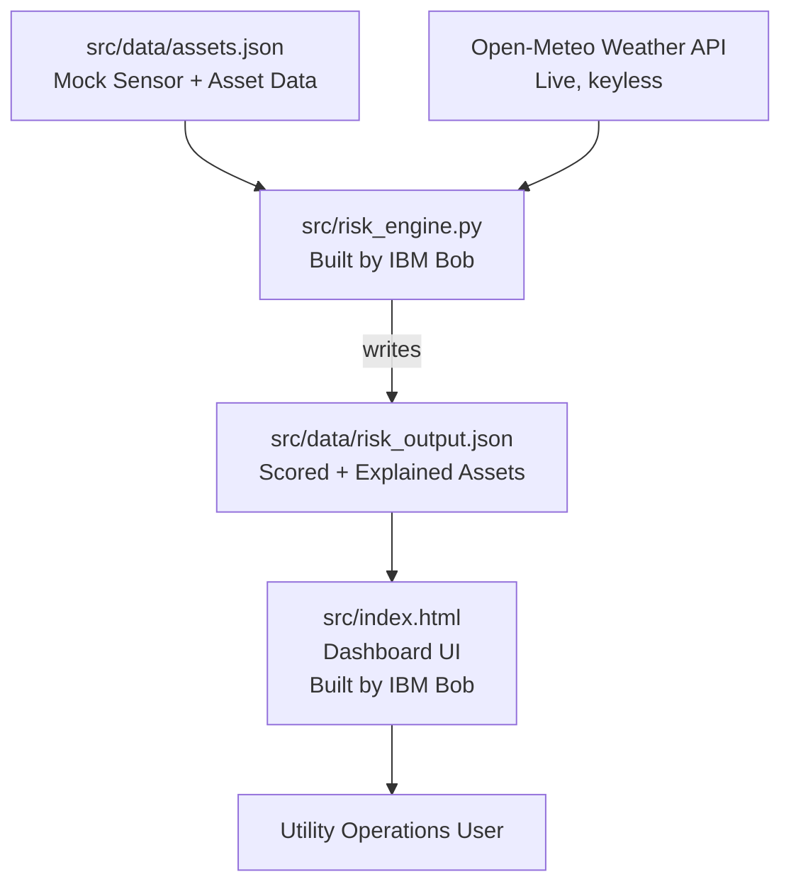

# System Architecture

## Architecture Diagram

## Component Table

| Component | Technology | Responsibility |
|---|---|---|
| Asset & Sensor Data | Static JSON (`assets.json`) | Stores synthetic sensor readings (temperature, vibration, oil quality, partial discharge) and metadata (criticality, customers served, age, prior failures) for each monitored grid asset |
| Weather Integration | Open-Meteo REST API (Python `requests`) | Provides live temperature, wind speed, and precipitation for the monitored region, no API key required |
| Risk Engine | Python (`risk_engine.py`), built by IBM Bob | Loads asset data, fetches live weather, computes a weighted risk score per asset, generates a plain-language explanation and a recommended action, writes results to `risk_output.json` |
| Risk Output | Static JSON (`risk_output.json`) | Structured, scored, and explained output — the single source of truth the dashboard reads from |
| Dashboard UI | Self-contained HTML/CSS/JavaScript (`index.html`), built by IBM Bob | Renders the risk data as a sorted, color-coded, interactive dashboard for utility operations staff |
| IBM Bob | AI coding agent (Agent mode, IDE extension) | Wrote and iteratively debugged both `risk_engine.py` and `index.html`, including diagnosing and fixing a scoring-normalization bug based on reviewing its own output |

## End-to-End Data Flow

1. **Data Ingestion** — `risk_engine.py` loads the static asset/sensor dataset and calls the Open-Meteo API for the monitored region's current weather.
2. **Risk Scoring** — for each asset, sensor readings are scored against safe-operating thresholds (60% weight), weather conditions are scored against safety ceilings (20% weight), and the asset's operational criticality contributes the remaining 20%. These are combined so that the single worst-breaching sensor sets a high floor for the score, and any additional breaches stack on top of it — rather than being averaged away by healthier readings.
3. **Explanation Generation** — for each asset, a plain-language paragraph is generated citing the specific sensor values and weather conditions that produced its score, along with a concrete, time-bound recommended action.
4. **Output** — all of this is written to `risk_output.json` as a single structured array, sorted by nothing in particular at this stage (sorting happens at render time).
5. **Rendering** — `index.html` loads `risk_output.json` (or an embedded fallback copy of the same data, for when the page is opened directly as a local file rather than through a server), sorts assets by risk score descending, and renders them as color-coded, expandable cards alongside summary statistics and a risk-distribution chart.

## Security & Scalability Notes

- **No credentials or secrets are used anywhere in this project.** The only external call is to Open-Meteo's public, keyless weather API. A `.bobignore` file is configured at the repository root to prevent any future secrets (`.env`, `secrets/`, `*.key`, `config/credentials.json`) from being indexed, even though none currently exist in this codebase.
- **No PII.** All asset and sensor data is synthetic, generated for demonstration purposes, and explicitly documented as such.
- **Scalability path:** the current architecture reads a static JSON file for simplicity and reliability within the hackathon's scope. In a production setting, `assets.json` would be replaced by a live connection to a utility's existing SCADA/sensor telemetry system, and `risk_output.json` would be replaced by a proper database or message queue — the scoring and explanation logic in `risk_engine.py` would not need to change, since it already operates on the same structured shape of data either way.
- **No live deployment.** Per hackathon rules, this solution runs and is demonstrated entirely locally; no cloud hosting is used.
